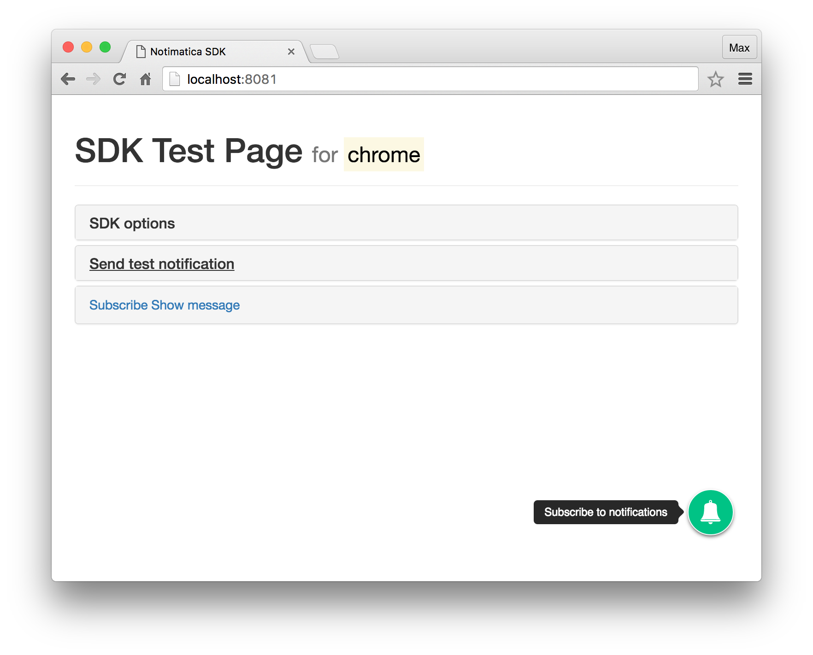

# Notimatica.io JavaScript SDK

## Installation

To install SDK you have to add this code to your head tag:

```html
<script src="https://cdn.notimatica.io/sdks/latest/notimatica-sdk.js" async></script>
<script>
  var Notimatica = Notimatica || [];
  Notimatica.push(['init', {
    project: 'PROJECT_ID'
  }]);
</script>
```

Where replace `PROJECT_ID` is your project's ID that can be found in my.notimatica.io

### Options

Options should be set in `init` function.

| Name | Type | Default value | Description |
|------|------|---------------|-------------|
| `project` | String | `null` | Your project UUID |
| `debug` | Boolean | `false` | Send debug messages to the console |
| `tags` | Array | `[]` | Additional set of tags for the user |
| `autoSubscribe` | Boolean | `false` | Do you want to start subscription process right after page load. For HTTP sites always `false`. |
| `usePopup` | Boolean | `false` | Force subscribing via HTTP fallback popup. For HTTP sites always `true` |
| `popup` | Object | `{ height: 450, width: 550 }` | HTTP fallback popup options. Height and width in pixels |
| `plugins` | Object | `{}` | Map of plugins to enable and their options |
| `strings` | Object | `{}` | Map of localization strings. Mainly used when you want to localize string from plugins |
| `defaultLocale` | String | `'en'` | Default locale to use |
| `sdkPath` | String | `'https://cdn.notimatica.io/sdks/latest'` | Where to get SDK files |

### API

Since SDK is loaded async way, all it's methods should be called via `push([METHOD_NAME, ARGS...])` wrapper. The only exception is when you are 100% sure that it is already loaded and inited. For instance, in events callbacks.

- `init({Object} options)` - Init SDK
- `subscribe()` - Subscribe to notifications
- `unsubscribe()` - Unsubscribe from notifications
- `isSubscribed() : {Boolean}` - If user us subscribed
- `isUnsubscribed() : {Boolean}` - If user is unsubscribed

### Events

SDK emits events for every major...events :smile: so you can easily subscribe on them and provide your own callbacks this way:

```javascript
Notimatica.push(['on', 'subscribe:success', function () {
  alert('From now you are subscribed to our news')
}])
```

If debug mode is on, SDK will send logs into console for every event emitted.

Pubic events:

| Event | Vars | Description |
|-------|------|-------------|
| 'ready' | - | Notimatica SDK is fully loaded and ready for action |
| `unsupported` | {String} message | User's browser doesn't support notifications |
| `warning` | {String} message | Warning was emitted |
| `error` | {*} err | Error was emitted |
| `subscribe:start` | - | User started subscription |
| `subscribe:success` | {String} user's Notimatica internal uuid | User successfully subscribed |
| `subscribe:fail` | {*} err | Something failed subscription process |
| `unsubscribe:start` | - | User started unsubscribing |
| `unsubscribe:success` | - | User successfully unsubscribed |
| `unsubscribe:fail` | {*} err | For some reason user failed to unsubscribe |

Internal events:

| Event | Description |
|-------|-------------|
| `subscribe:subscription` | {String} browser's endpoint | Driver received browser's endpoint |
| `register:start` | {Object} user's data | SDK makes attempt to register user in Notimatica |
| `register:success` | {Object} Notimatica user | Registration succeeded |
| `register:fail` | {*} err | Registration failed |
| `unregister:start` | - | SDK makes attempt to unregister from Notimatica |
| `unregister:success` | - | Notimatica forgot about user |
| `unregister:fail` | {*} err | Notimatica failed to unregister user |
| `driver:ready` | {Object} driver | Push notifications driver inited and ready |
| `plugin:ready` | {Object} plugin | Plugin was loaded and ready to init |

### Localization

All strings can be translated on any language you like. By default all strings are for `en` language.
If you want to overwrite any of them or add your own language, add them to `strings` options like this:

```javascript
{
  strings: {
    en: {
      'tooltip.subscribe': 'Subscribe to news',
    },
    ru: {
      'tooltip.subscribe': 'Подписаться на новости',
    },
  }
}
```

### Plugins

SDK has an ability to connect plugins.

#### Button

Simple way to provide user action button to subscribe to notifications. With nice popover to interact with user.



[README](src/plugins/button/README.md)

## Example

Here is a simple example how to provide subscribe / unsubscribe manually:

```html
<span class="status"></span>
<a href="#" class="subscribe-link hidden">Subscribe</a>
<a href="#" class="unsubscribe-link hidden">Unsubscribe</a>
```

```javascript
Notimatica.push(['on', 'ready', function () {
  $('.status').text(Notimatica.isSubscribed() ? 'Subscribed' : 'Unsubscribed')

  if (Notimatica.isUnsubscribed()) {
    $('.subscribe-link').removeClass('hidden')
  } else {
    $('.unsubscribe-link').removeClass('hidden')
  }
}])

$('.subscribe-link').on('click', function (e) {
  e.preventDefault()
  Notimatica.push(['subscribe'])
})
$('.unsubscribe-link').on('click', function (e) {
  e.preventDefault()
  Notimatica.push(['unsubscribe'])
})

Notimatica.push(['on', 'subscribe:success', function () {
  $('.subscribe-link').addClass('hidden')
  $('.unsubscribe-link').removeClass('hidden')
}])

Notimatica.push(['on', 'unsubscribe:success', function () {
  $('.subscribe-link').removeClass('hidden')
  $('.unsubscribe-link').addClass('hidden')
}])
```

## Contributing

Feel free to contribute. Fork, build, send pull request!

### Build process

``` bash
# install dependencies
npm install

# serve with hot reload at localhost:8081
npm run dev

# build for production with minification
npm run build
```
